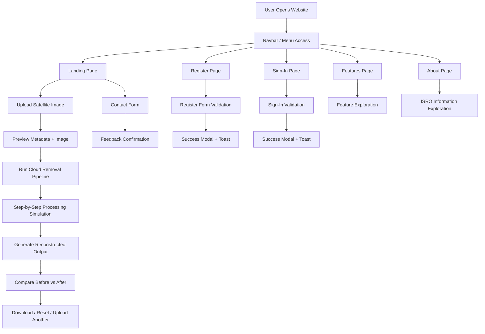

# LISS-IV Cloud Reconstruction Frontend

Advanced frontend prototype for a Generative AI based cloud-removal and reconstruction workflow for LISS-IV satellite imagery. The project is built as a static multi-page interface using HTML, CSS, and JavaScript, with interactive navigation, animated processing flow, register/sign-in pages, and ISRO-focused information pages.

## Project Goals

- Present a polished research-demo UI for cloud detection and reconstruction.
- Simulate an end-to-end processing pipeline for showcase and hackathon demos.
- Provide a multi-page product experience with landing, about, features, register, and sign-in flows.
- Keep the project lightweight and easy to deploy without a framework.

## Tech Stack

- HTML5
- CSS3
- Vanilla JavaScript
- Local SVG assets for navigation icons

## Page Map

- `index.html`: landing page, processing demo, comparison UI, and contact section
- `features.html`: feature-focused information page
- `about.html`: ISRO organization overview page
- `about-features.html`: combined information hub
- `register.html`: registration flow
- `sign-in.html`: sign-in flow
- `styles.css`: shared primary styling for landing, register, and sign-in pages
- `about-features.css`: styling for about/features information pages
- `script.js`: landing page interactions
- `register.js`: registration page interactions
- `sign-in.js`: sign-in page interactions
- `about-features.js`: information-page interactions
- `assets/icons/`: downloaded local SVG icon assets

## Functional Flow Chart



## Pictorial Design Overview

```text
+----------------------------------------------------------------------------------+
| Header / Smart Menu Button                                                       |
|  [ Menu ]   [ Brand / Product Title ]                                            |
+----------------------------------------------------------------------------------+
| Left Slide Drawer                                                                |
|  - Home                                                                          |
|  - Features                                                                      |
|  - About                                                                         |
|  - Contact / Register / Official ISRO                                            |
+----------------------------------------------------------------------------------+
| Hero Section                                                                     |
|  Large title + supporting copy + CTA actions                                     |
+----------------------------------------------------------------------------------+
| Upload + Preview Panel                                                           |
|  Drag/drop image -> metadata -> preview image                                    |
+----------------------------------------------------------------------------------+
| Processing Panel                                                                 |
|  Remove Clouds -> progress -> pipeline steps -> reconstructed result             |
+----------------------------------------------------------------------------------+
| Comparison + Metrics                                                             |
|  Before/After slider -> stats -> output actions                                  |
+----------------------------------------------------------------------------------+
| Applications / Info Cards                                                        |
|  Research use cases, domain cards, supporting explanations                       |
+----------------------------------------------------------------------------------+
| Contact / Register / Sign-In                                                     |
|  Validation + toast feedback + modal success response                            |
+----------------------------------------------------------------------------------+
```

## Interaction Design Flow

### Navigation

- A circular menu button opens a left-side drawer navigation.
- Clicking outside the drawer closes it.
- Pressing `Esc` closes the drawer.
- Active page links are visually highlighted.

### Landing Workflow

- User uploads a PNG or JPG image.
- A preview is generated with metadata.
- The pipeline button simulates cloud-removal stages.
- Progress and step states update live.
- A reconstructed image is shown for comparison.

### Form Workflow

- Register and sign-in pages validate fields on submit.
- Invalid fields are highlighted.
- Success triggers toast + modal confirmation.

## Advanced UI Modules

### 1. Drawer Navigation

- Left slide-out navigation drawer
- Local downloaded SVG icons
- Page-specific active state
- Shared behavior across all primary pages

### 2. Mock AI Processing Engine

- Animated processing progress
- Sequential pipeline step activation
- Visual transition from input preview to processed result

### 3. Comparison Experience

- Before/after image comparison slider
- Supporting metric cards and images
- Simulated research presentation flow

### 4. Information Architecture

- Dedicated pages for About and Features
- Shared visual identity across landing and info pages
- Clean separation of content, interaction, and styling layers

## File Architecture

```text
LISS4-Cloud-Reconstruction/
|-- index.html
|-- register.html
|-- sign-in.html
|-- about.html
|-- features.html
|-- about-features.html
|-- styles.css
|-- about-features.css
|-- script.js
|-- register.js
|-- sign-in.js
|-- about-features.js
|-- README.md
`-- assets/
    `-- icons/
        |-- about.svg
        |-- contact.svg
        |-- features.svg
        |-- globe.svg
        |-- google-menu.svg
        |-- home.svg
        `-- register.svg
```

## How To Run

1. Open the project folder locally.
2. Launch `index.html` in a browser.
3. Navigate through the drawer menu to test the full multi-page flow.

## Suggested Future Enhancements

- Connect real backend APIs for upload and processing.
- Replace mock output with actual ML inference results.
- Add persistent authentication and session state.
- Add responsive test coverage and accessibility audit pass.
- Convert the static prototype into a component-based app if the project scales.

## Authoring Note

This repository is currently structured as a high-fidelity static frontend prototype intended for presentation, demo, and expansion into a production-grade research dashboard.
Update PR 1 
Update PR 2 
Update PR 3 
Update PR 4 
Update PR 5 
Update PR 6 
Update PR 7 
Update PR 8 
Update PR 9 
