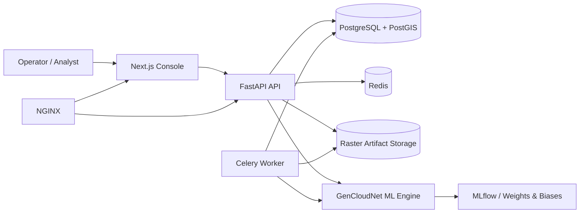

# Architecture

## System Overview

## Backend Layers

- `api`: route handlers and dependency injection.
- `services`: orchestration, business rules, artifact generation, metrics aggregation.
- `repositories`: persistence access for users, imagery, and jobs.
- `domain`: ORM models and response/request schemas.
- `workers`: Celery app and asynchronous task entrypoints.

## ML Workflow

1. Ingest raster and preserve geospatial metadata.
2. Normalize, align, denoise, and create preview assets.
3. Detect cloud mask using heuristic or trainable segmentation model.
4. Fuse temporal and SAR context.
5. Reconstruct occluded pixels using deterministic inpainting or learned generators.
6. Optionally super-resolve and enhance.
7. Produce confidence, explainability, and evaluation metrics.

## Frontend Workflow

- Authentication and token persistence.
- Asset upload and scene inventory.
- Pipeline launch with model selection.
- History and metrics inspection.
- Geospatial visualization with Leaflet or Mapbox.
