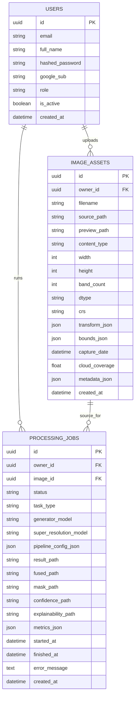

# ER Diagram

```mermaid
erDiagram
    USERS ||--o{ IMAGE_ASSETS : uploads
    USERS ||--o{ PROCESSING_JOBS : runs
    IMAGE_ASSETS ||--o{ PROCESSING_JOBS : source_for

    USERS {
        uuid id PK
        string email
        string full_name
        string hashed_password
        string google_sub
        string role
        boolean is_active
        datetime created_at
    }

    IMAGE_ASSETS {
        uuid id PK
        uuid owner_id FK
        string filename
        string source_path
        string preview_path
        string content_type
        int width
        int height
        int band_count
        string dtype
        string crs
        json transform_json
        json bounds_json
        datetime capture_date
        float cloud_coverage
        json metadata_json
        datetime created_at
    }

    PROCESSING_JOBS {
        uuid id PK
        uuid owner_id FK
        uuid image_id FK
        string status
        string task_type
        string generator_model
        string super_resolution_model
        json pipeline_config_json
        string result_path
        string fused_path
        string mask_path
        string confidence_path
        string explainability_path
        json metrics_json
        datetime started_at
        datetime finished_at
        text error_message
        datetime created_at
    }
```
